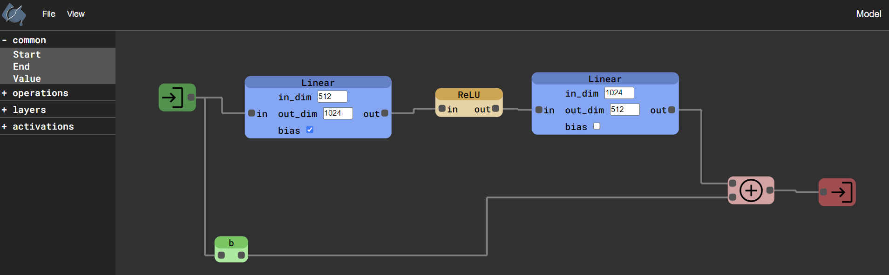
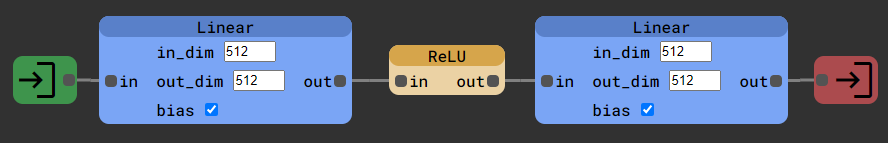

<h1 style="display:flex;justify-content:center">
   pytorch-diagrams
</h1>

<h3 align="center">
   <p>A tool for visually creating pytorch models. [<a href="https://ryanbaten.github.io/pytorch-diagrams/">Demo</a>]</p>
</h3>



:warning: There are still many improvements to the project to be made and node types to be added.

## User Quick Start

1\. <b>Click and drag the "Start" and "End" options in the sidebar onto the main workspace.</b> Every model must have at least one Start and one End node. These nodes are used to determine the inputs and outputs of the model and the order in which items should be ordered on export.

2\. <b>Add in Values, Operations, Layers, and/or Activations</b> to your graph. These are the logical building blocks for the computation graph of a model. Value nodes are special nodes which represent named variables. They will allow you to edit their titles to set the names you will see in any exported code. If you don't add values between other logical blocks, they will be automatically generated.

3\. <b>Link the nodes together.</b> Make sure the graph you create connects the end nodes to the start nodes (usually indirectly). The order in which blocks are linked will determine the order of operations within your model.

4\. <b>Export results.</b> When you're happy with your diagram, you can edit the filename by editing the name in the top right corner. Then, you can save the state of the diagram by clicking `File > Export Diagram`. To generate Pytorch code corresponding to your diagram, you can clicking `File > Export To Pytorch`

## Example

The following is a simple 2 layer Feedforward Neural Network designed in the tool.


If you replicate this network by importing the json file: `examples/model_exports/feedforward.json` and click `File > Export To Pytorch`, it will generate the following code:

```python
from torch.nn import Module, Linear, ReLU


class Model(Module):
    def __init__(self):
        super(Model, self).__init__()
        self.linear_a = Linear(512, 512, bias=True)
        self.relu_a = ReLU()
        self.linear_b = Linear(512, 512, bias=True)

    def forward(self, b):
        c = self.linear_a(b)
        d = self.relu_a(c)
        a = self.linear_b(d)
        return a
```

The generated code is working pytorch code corresponding to the graph in the drawn diagram. If you run the generated code followed by the below, you should see similar output but with different numbers since the input in the example is a randomly generated tensor.

```python
>>> import torch
>>> sample_input = torch.rand(16, 512) # Example uses batch size of 16
>>> model = Model()
>>> model(sample_input)
tensor([[-0.0507, -0.1469, -0.1246,  ...,  0.0676,  0.0444,  0.0618],
        [ 0.0317, -0.1945,  0.0749,  ...,  0.0181,  0.0553,  0.0136],
        [-0.0203, -0.1148, -0.1104,  ...,  0.0394,  0.1237,  0.0983],
        ...,
        [-0.0395, -0.1562, -0.0183,  ...,  0.0544,  0.1970, -0.0355],
        [ 0.0036, -0.1865,  0.0470,  ...,  0.1361,  0.2892, -0.0376],
        [ 0.0397, -0.2128,  0.0600,  ...,  0.0945,  0.1512, -0.0326]],
       grad_fn=<AddmmBackward0>)
```

## Local Setup

To run locally, clone the repo and then run the following:

```
yarn start
```

The yarn output will let you know which address the app is serving at (most likely localhost:8080).

## About

This is my first personal project using any of the following tools: Javascript, Typescript, React, CSS. If you have any feedback about common conventions to adopt or are interested in contributing, don't hesitate to reach out!
